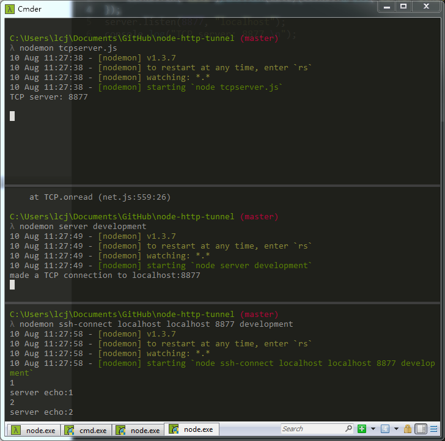

# simplized labs:

以发送一个数字1，一直到得到一个server echo:1为止，分析执行的过程。

准备：
1. client ,server,tunnel-client,tunnel-server 都在一个电脑上
2. 启动 server,一个tcp server

	nodemon tcpserver.js 
	

3. 启动tunnel server

	nodemon server development

4. 启用test client

	nodemon ssh-connect localhost  localhost 8877 development

现在，在ssh-connect 控制台上写点什么然后回车，

	1
	server echo :1
	2
	server echo :2

从tcp client发出的tcp 包，经由 localhost ,到localhost 8877 的tcp server，并带回了tcp server的问候：server echo:#client info

YES ! 拍照留念

# tcp client/server data flow test

1. tcp client /send:
	1
2. tcp server /return:
    server echo :1

# tunnel tcp client/server data flow test

1. tcp client /send
	1
2. tunnel client 
    1
    is tcp connection make ?
    	no: 
    		put http json:  {"method":"open","host":"","port":""}   -->3
    	yes :put http json : {"method":"data","stream_id":0,"data":"MQ=="}

3. tunnel server 
	method open : 命令tunnel sever建立一个连接到指定的host和端口。 		
	method data : 解出来data -> 1,发送此数据到指定host ,port 的tcp server

4. tcp server

    echo server:1
5. tunnel server:
    编码 [{"method":"data","stream_id":0,"data":"c2VydmVyIGVjaG86Mg0K"}]
    写入send_quene 
    定时器取出，response.write 到tunnel client

6. tunnel client

    on data ,on end :
    解出：echo server:1
    发送到tcp client
7. tcp client
    完成

# 组件职责

命令格式

   用来在tunnel c/s之间建立连接，传递数据
   格式为 [{"method":"","stream_id":,"data":""}]
   	  method可以为open，openack,data,end 
   	  其中 method data的值就是要传递的tcp data的base64格式。这样，技术tcp data是二进制数据，也可以打包为字符串，从而作为http传输
   	  其中 method open ,用来发给tunnel server ,要求它建立一个指定host和port的连接
   	  其中 method openack ,用来由tunnel server通知tunnel client ,指定连接已经建立
   通过http

tunnel-client

   创建侦听一个socks5服务，等待tcp client连接
   收到tcp client 的数据后，立即要求tunnel server 建立一个到指定host,port的连接
   完毕后，打包tcp data为 base64 的json包
   通过http发送到tunnel server
   收到tunnel server回复（在send_quene内），解包转发到tcp client
tunnel-server

   创建http server 等待tunnel client 的连接
   得到数据，如果是open ,就建立到tcp server的连接
   如果是data，就解压，得到原生内容，发给tcp server
   如果tcp server来数据，编码为json,通知对应的tunnel client

	   					

